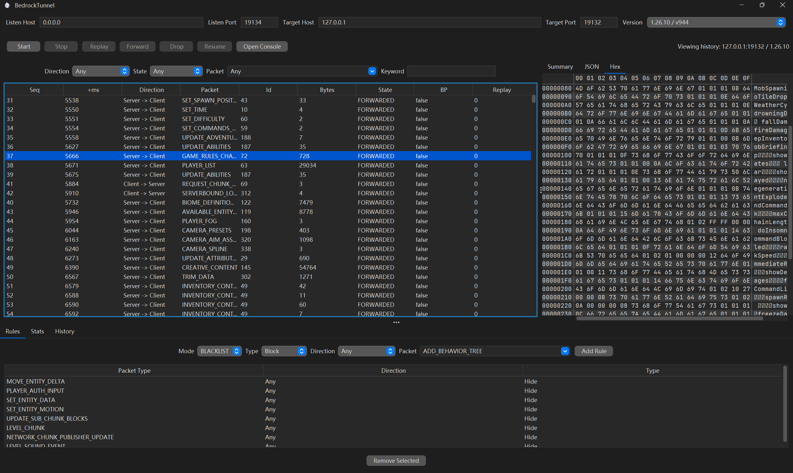

# BedrockTunnel 🚇

BedrockTunnel is a desktop MITM packet capture tool for Minecraft: Bedrock Edition. It sits between one Bedrock client and one target server, captures traffic in both directions, and provides a desktop UI for inspection and control.



## ✨ Features

- 🖥️ A desktop GUI built for live packet inspection
- 🌐 Live traffic capture between a Bedrock client and a target server
- 📦 Packet details in `Summary`, `JSON`, and `Hex` views
- 🔎 Packet filtering by direction, state, type, and keyword
- 🚫 Packet blocking with blacklist and whitelist modes
- 🙈 Packet hiding rules for decluttering the live packet list
- ⏸️ Packet breakpoints with forward, drop, and resume controls
- 🔁 Basic packet replay during a live session
- 📊 Traffic statistics and per-packet counts
- 🗂️ Saved capture history with offline review

## 📋 Requirements

- Java 21
- Gradle 9.4.1
- A Bedrock client and target server using the same protocol version selected in the UI

## ⬇️ Downloads

The GitHub `nightly` prerelease includes a Windows app image zip that can be unpacked and launched directly without installing Java separately.

- Download the Windows package from the `Nightly Build` release artifacts
- Unzip it
- Run `BedrockTunnel.exe`

## 🔢 Supported Versions

BedrockTunnel currently supports the following versions:

<details>
<summary>Version list</summary>

- `1.7.0` / `v291`
- `1.8.0` / `v313`
- `1.9.0` / `v332`
- `1.10.0` / `v340`
- `1.11.0` / `v354`
- `1.12.0` / `v361`
- `1.13.0` / `v388`
- `1.14.0` / `v389`
- `1.14.60` / `v390`
- `1.16.0` / `v407`
- `1.16.20` / `v408`
- `1.16.100` / `v419`
- `1.16.200` / `v422`
- `1.16.210` / `v428`
- `1.16.220` / `v431`
- `1.17.0` / `v440`
- `1.17.10` / `v448`
- `1.17.30` / `v465`
- `1.17.40` / `v471`
- `1.18.0` / `v475`
- `1.18.10` / `v486`
- `1.18.30` / `v503`
- `1.19.0` / `v527`
- `1.19.10` / `v534`
- `1.19.20` / `v544`
- `1.19.21` / `v545`
- `1.19.30` / `v554`
- `1.19.40` / `v557`
- `1.19.50` / `v560`
- `1.19.60` / `v567`
- `1.19.63` / `v568`
- `1.19.70` / `v575`
- `1.19.80` / `v582`
- `1.20.0` / `v589`
- `1.20.10` / `v594`
- `1.20.30` / `v618`
- `1.20.40` / `v622`
- `1.20.50` / `v630`
- `1.20.50 (NetEase)` / `v630`
- `1.20.60` / `v649`
- `1.20.70` / `v662`
- `1.20.80` / `v671`
- `1.21.0` / `v685`
- `1.21.2` / `v686`
- `1.21.2 (NetEase)` / `v686`
- `1.21.20` / `v712`
- `1.21.30` / `v729`
- `1.21.40` / `v748`
- `1.21.50` / `v766`
- `1.21.50 (NetEase)` / `v766`
- `1.21.60` / `v776`
- `1.21.70` / `v786`
- `1.21.80` / `v800`
- `1.21.90` / `v818`
- `1.21.93` / `v819`
- `1.21.93 (NetEase)` / `v819`
- `1.21.100` / `v827`
- `1.21.111` / `v844`
- `1.21.120` / `v859`
- `1.21.124` / `v860`
- `1.21.130` / `v898`
- `1.26.0` / `v924`
- `1.26.10` / `v944`

</details>

## 🛠️ Build

Build the project:

```powershell
./gradlew build
```

Create the fat jar explicitly:

```powershell
./gradlew shadowJar
```

Create a Windows app image with a bundled runtime:

```powershell
./gradlew.bat packageAppImage
```

The runnable jar is written to:

- `build/libs/BedrockTunnel.jar`

The Windows app image is written to:

- `build/packaging/app-image/BedrockTunnel/`
- `build/packaging/app-image/BedrockTunnel/BedrockTunnel.exe`

## ▶️ Run

Run from Gradle:

```powershell
./gradlew run
```

Run the fat jar directly:

```powershell
java -jar build/libs/BedrockTunnel.jar
```

## 🚀 Quick Start

1. Start BedrockTunnel.
2. Enter the local listen host and port.
3. Enter the target Bedrock server host and port.
4. Select the Bedrock protocol version.
5. Click `Start`.
6. Point the Bedrock client to the local listen address instead of the real server.

## 🖥️ Interface Overview

- Top bar: tunnel settings and live controls
- Center: packet list on the left and packet details on the right
- Bottom tabs: rules, statistics, and capture history

## 🔍 Packet Views

- `Summary`: packet metadata and current state
- `JSON`: serialized packet content
- `Hex`: raw packet bytes

## 🧰 Filtering

You can filter the packet list by:

- Direction
- State
- Packet type
- Keyword

Keyword matching checks packet names, summary text, JSON text, and hex text.

## 🚦 Rules And Breakpoints

- Blocking rules can work in `BLACKLIST` or `WHITELIST` mode
- Rules currently match by direction and packet type
- `Hide` rules remove matching packets from the packet list without affecting forwarding
- Breakpoints pause live traffic when a matching packet appears
- `Block` rules stop matching packets from being forwarded
- While paused, you can forward or drop the breakpoint packet, then resume queued traffic

## 🔁 Replay

- Replay is available in live mode
- It resends the selected captured packet with its original direction
- Packet editing is not included yet
- Offline history replay is not included yet

## 📊 Statistics

The `Stats` tab shows:

- Total packet count
- Total byte count
- Total replay count
- Breakpoint hit count
- Per-packet-type counters

## 🗂️ Capture History

Captured sessions are saved locally and can be reopened from the `History` tab for browsing, filtering, and reviewing packet details later.
